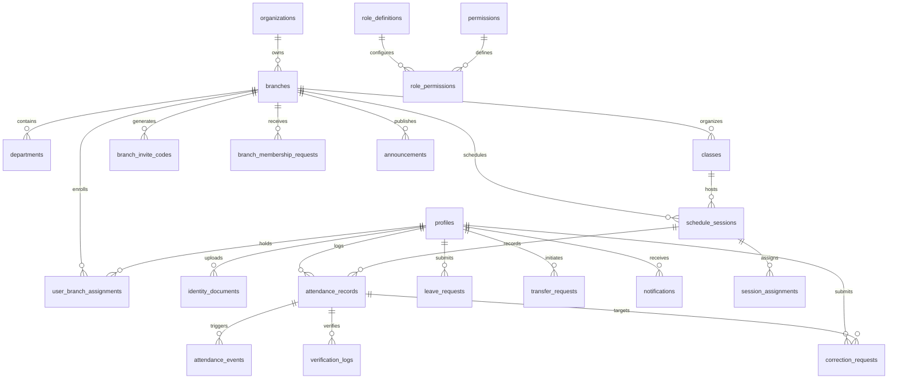

# Kivora Entity Relationship Diagram

```mermaid
erDiagram
    organizations ||--o{ branches : owns
    branches ||--o{ departments : contains
    branches ||--o{ classes : organizes
    branches ||--o{ schedule_sessions : schedules
    branches ||--o{ user_branch_assignments : enrolls
    branches ||--o{ branch_invite_codes : generates
    branches ||--o{ branch_membership_requests : receives
    branches ||--o{ announcements : publishes

    profiles ||--o{ user_branch_assignments : holds
    profiles ||--o{ identity_documents : uploads
    profiles ||--o{ attendance_records : logs
    profiles ||--o{ leave_requests : submits
    profiles ||--o{ correction_requests : submits
    profiles ||--o{ transfer_requests : initiates
    profiles ||--o{ notifications : receives

    classes ||--o{ schedule_sessions : hosts
    schedule_sessions ||--o{ session_assignments : assigns
    schedule_sessions ||--o{ attendance_records : records
    
    attendance_records ||--o{ attendance_events : triggers
    attendance_records ||--o{ verification_logs : verifies
    attendance_records ||--o{ correction_requests : targets

    role_definitions ||--o{ role_permissions : configures
    permissions ||--o{ role_permissions : defines
```
